# ARCHITECTURE.md — DiakoniaApp

Documento técnico da arquitetura. Complementa o [CLAUDE.md](./CLAUDE.md), que cobre
onboarding, regras de negócio e riscos.

> Levantado em **20/08/2026** por medição direta do repositório e do banco de
> produção. Onde não foi possível concluir, está escrito **(incerto)**.

**Índice** — [1. Contexto](#1-visão-de-contexto) · [2. Arquitetura atual](#2-arquitetura-atual) ·
[3. Autenticação](#3-fluxo-de-autenticação) · [4. Autorização](#4-fluxo-de-autorização) ·
[5. Supabase](#5-integração-com-supabase) · [6. React → RPC → Banco](#6-fluxo-react--rpc--banco) ·
[7. Entidades](#7-principais-entidades) · [8. Dependências](#8-dependências-entre-módulos)

---

## 1. Visão de contexto

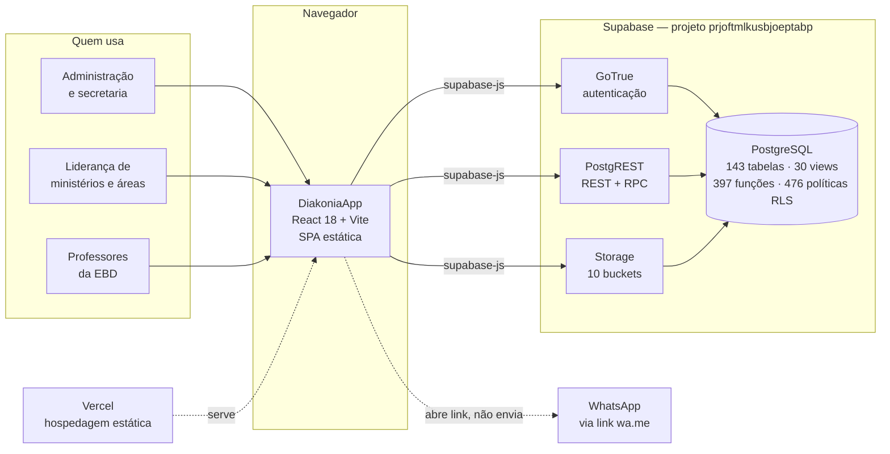
```mermaid
flowchart LR
    subgraph pessoas["Quem usa"]
        A["Administração<br/>e secretaria"]
        L["Liderança de<br/>ministérios e áreas"]
        P["Professores<br/>da EBD"]
    end

    subgraph nav["Navegador"]
        SPA["DiakoniaApp<br/>React 18 + Vite<br/>SPA estática"]
    end

    subgraph sb["Supabase — projeto prjoftmlkusbjoeptabp"]
        GT["GoTrue<br/>autenticação"]
        PR["PostgREST<br/>REST + RPC"]
        ST["Storage<br/>10 buckets"]
        PG[("PostgreSQL<br/>143 tabelas · 30 views<br/>397 funções · 476 políticas RLS")]
    end

    WA["WhatsApp<br/>via link wa.me"]
    VC["Vercel<br/>hospedagem estática"]

    A --> SPA
    L --> SPA
    P --> SPA
    SPA -->|supabase-js| GT
    SPA -->|supabase-js| PR
    SPA -->|supabase-js| ST
    GT --> PG
    PR --> PG
    ST --> PG
    SPA -.->|abre link, não envia| WA
    VC -.->|serve| SPA
```

**O ponto que define tudo: não há backend próprio.** O navegador fala direto com o
Supabase. Não existe camada onde esconder segredo ou impor regra que o cliente não
possa contornar — por isso **a segurança é inteiramente da RLS**, e as 143 tabelas
têm RLS ligada, sem exceção.

O WhatsApp entra apenas como **link `wa.me`**: o sistema monta a mensagem e abre o
aplicativo; quem envia é a pessoa. Não há API oficial e nenhuma resposta volta.

---

## 2. Arquitetura atual

### 2.1 Camadas pretendidas

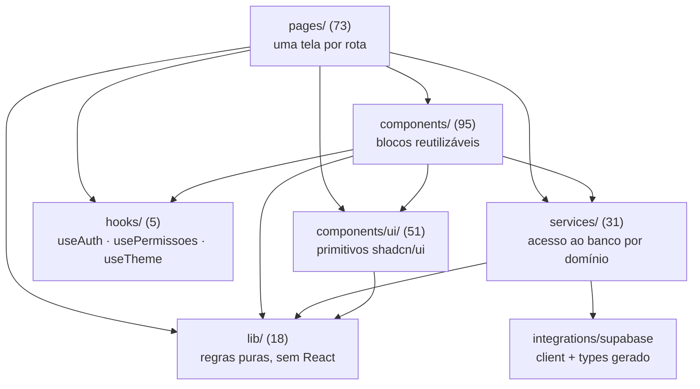
```mermaid
flowchart TD
    PG["pages/ (73)<br/>uma tela por rota"]
    CO["components/ (95)<br/>blocos reutilizáveis"]
    UI["components/ui/ (51)<br/>primitivos shadcn/ui"]
    HK["hooks/ (5)<br/>useAuth · usePermissoes · useTheme"]
    SV["services/ (31)<br/>acesso ao banco por domínio"]
    LB["lib/ (18)<br/>regras puras, sem React"]
    IN["integrations/supabase<br/>client + types gerado"]

    PG --> CO
    PG --> UI
    PG --> HK
    PG --> SV
    PG --> LB
    CO --> UI
    CO --> SV
    CO --> LB
    CO --> HK
    SV --> IN
    SV --> LB
    UI --> LB
```

### 2.2 Camadas reais — onde o desenho não se sustenta

Medido nos 285 arquivos:

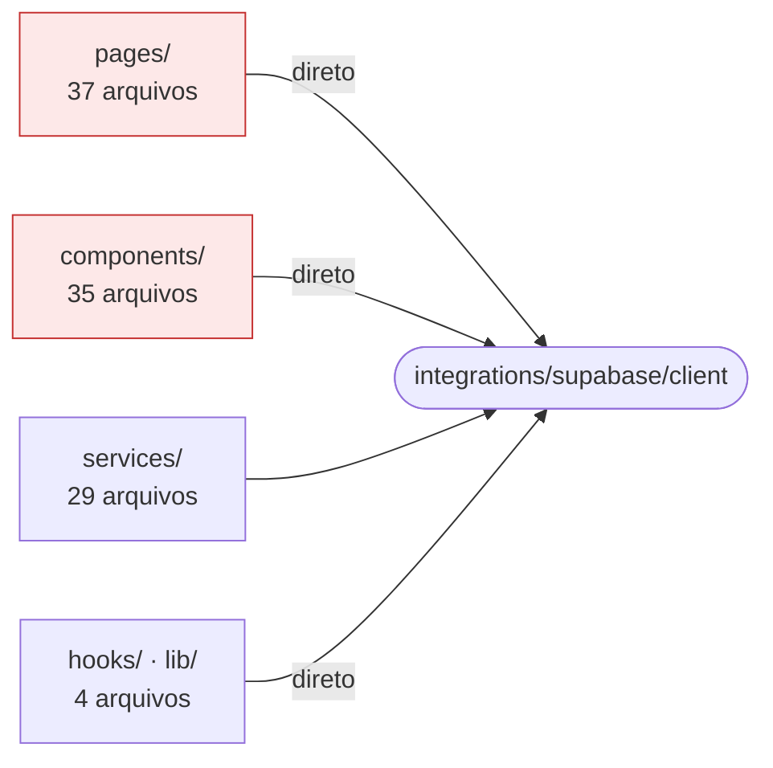
```mermaid
flowchart LR
    PG["pages/<br/>37 arquivos"]
    CO["components/<br/>35 arquivos"]
    SV["services/<br/>29 arquivos"]
    HK["hooks/ · lib/<br/>4 arquivos"]
    CL(["integrations/supabase/client"])

    PG -->|direto| CL
    CO -->|direto| CL
    SV --> CL
    HK -->|direto| CL

    style PG fill:#fde8e8,stroke:#c53030
    style CO fill:#fde8e8,stroke:#c53030
```

**72 arquivos de `pages/` e `components/` importam o client do Supabase direto** —
mais do que os 29 de `services/`. A regra "todo acesso ao banco passa por um serviço"
descreve a intenção, **não o estado atual**.

Consequência prática: ao caçar uma consulta, procurar em `services/` **não basta**.

Outras tensões medidas:

| Observação | Número | Leitura |
|---|---|---|
| `components/` importando `pages/` | 6 imports | Inversão de camada — componente dependendo de tela |
| Serviço importando outro serviço | 3 casos | Baixo acoplamento: `acessoService→userService`, `fiscalService→ocrService`, `voluntariosPainel→perfilServico` |
| Serviços mais consumidos | `arrecadacaoService` e `finService` (16 cada), `ebdService` (12) | Os módulos mais estruturados |

### 2.3 Onde mora a lógica de negócio

**No banco.** O React chama **80 RPCs distintas**. Um bug de regra provavelmente está
numa função SQL, não num `.tsx`.

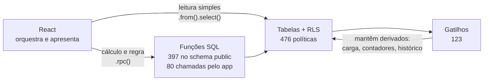
```mermaid
flowchart LR
    R["React<br/>orquestra e apresenta"]
    F["Funções SQL<br/>397 no schema public<br/>80 chamadas pelo app"]
    T["Tabelas + RLS<br/>476 políticas"]
    G["Gatilhos<br/>123"]

    R -->|"leitura simples<br/>.from().select()"| T
    R -->|"cálculo e regra<br/>.rpc()"| F
    F --> T
    T --> G
    G -->|"mantêm derivados:<br/>carga, contadores, histórico"| T
```

Exemplos do que só existe em SQL: `sugerir_voluntarios_escala` (motor de sugestão com
score e motivo legível), `esperados_da_classe` (cruza faixa etária, gênero,
professores e matrículas em outras classes), `fin_previsao_caixa`,
`gov_executar_assembleia`, `minhas_permissoes`.

---

## 3. Fluxo de autenticação

### 3.1 A decisão que molda o login

**O login é por telefone.** O Supabase Auth exige e-mail, então o sistema fabrica um:

```
(21) 98399-1229  →  5521983991229@app.diakonia
```

A conversão está em `pages/Auth.tsx` (`telefoneParaEmail`). Consequência: **o e-mail
no `auth.users` é sintético e não serve para contato** — o e-mail real da pessoa vive
em `membros.email`.

### 3.2 Entrada pela senha

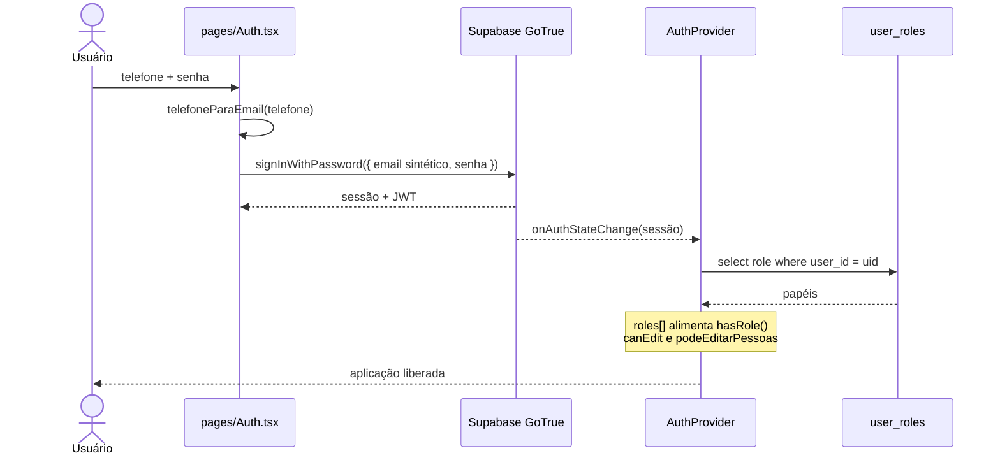
```mermaid
sequenceDiagram
    actor U as Usuário
    participant A as pages/Auth.tsx
    participant GT as Supabase GoTrue
    participant AP as AuthProvider
    participant UR as user_roles

    U->>A: telefone + senha
    A->>A: telefoneParaEmail(telefone)
    A->>GT: signInWithPassword({ email sintético, senha })
    GT-->>A: sessão + JWT
    GT-->>AP: onAuthStateChange(sessão)
    AP->>UR: select role where user_id = uid
    UR-->>AP: papéis
    Note over AP: roles[] alimenta hasRole()<br/>canEdit e podeEditarPessoas
    AP-->>U: aplicação liberada
```

`AuthProvider` (`hooks/useAuth.tsx`) mantém `user`, `session`, `roles` e `loading`.
Assina `onAuthStateChange` **e** chama `getSession()` na montagem — o primeiro cobre
troca de sessão, o segundo cobre recarregar a página.

### 3.3 Os três portões depois do login

`AppLayout` roda esta cadeia em toda navegação. **Cada portão desvia e interrompe.**

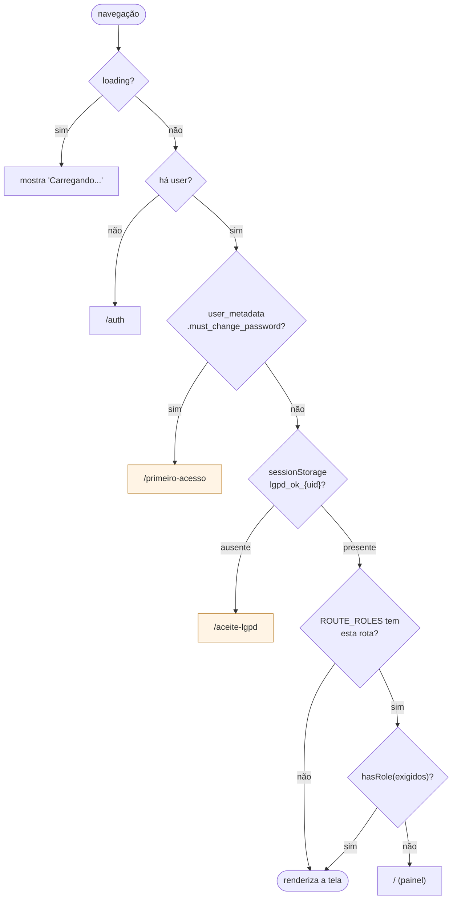
```mermaid
flowchart TD
    S(["navegação"]) --> L{"loading?"}
    L -->|sim| W["mostra 'Carregando...'"]
    L -->|não| U{"há user?"}
    U -->|não| AUTH["/auth"]
    U -->|sim| MC{"user_metadata<br/>.must_change_password?"}
    MC -->|sim| PA["/primeiro-acesso"]
    MC -->|não| LG{"sessionStorage<br/>lgpd_ok_{uid}?"}
    LG -->|ausente| LGPD["/aceite-lgpd"]
    LG -->|presente| RR{"ROUTE_ROLES tem<br/>esta rota?"}
    RR -->|não| OK(["renderiza a tela"])
    RR -->|sim| HR{"hasRole(exigidos)?"}
    HR -->|não| HOME["/ (painel)"]
    HR -->|sim| OK

    style LGPD fill:#fff4e5,stroke:#b7791f
    style PA fill:#fff4e5,stroke:#b7791f
```

**Duas observações sobre este desenho:**

- O aceite de LGPD usa **`sessionStorage`**, não o banco. Fechar o navegador faz o
  aceite ser pedido de novo. O registro persistente existe na tabela `consentimento`
  (23 linhas), mas **o portão não a consulta** — ele olha só a marca de sessão.
- `must_change_password` vem do **`user_metadata` do JWT**, não de `profiles`.

### 3.4 Os quatro caminhos de entrada

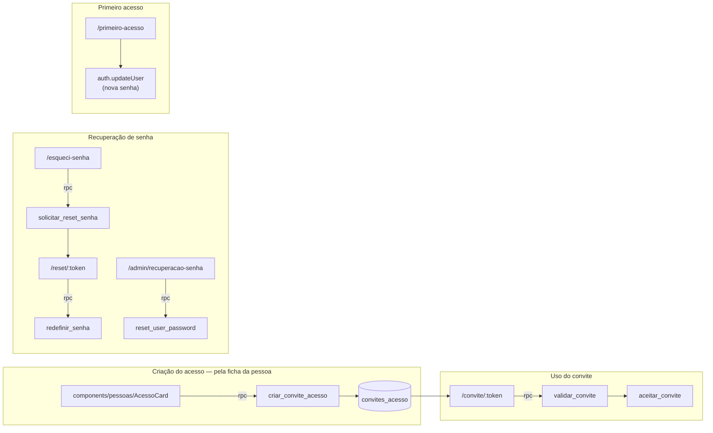
```mermaid
flowchart LR
    subgraph criacao["Criação do acesso — pela ficha da pessoa"]
        AC["components/pessoas/AcessoCard"] -->|rpc| CC["criar_convite_acesso"]
        CC --> CV[("convites_acesso")]
    end

    subgraph uso["Uso do convite"]
        CV --> CP["/convite/:token"]
        CP -->|rpc| VC["validar_convite"]
        VC --> ACE["aceitar_convite"]
    end

    subgraph recuperacao["Recuperação de senha"]
        ES["/esqueci-senha"] -->|rpc| SR["solicitar_reset_senha"]
        SR --> RT["/reset/:token"]
        RT -->|rpc| RS["redefinir_senha"]
        ADM["/admin/recuperacao-senha"] -->|rpc| RUP["reset_user_password"]
    end

    subgraph primeiro["Primeiro acesso"]
        PA2["/primeiro-acesso"] --> UP["auth.updateUser<br/>(nova senha)"]
    end
```

Todas as operações sensíveis passam por **RPC com `SECURITY DEFINER`**, não por
escrita direta em tabela. É a única forma de fazê-lo sem backend.

---

## 4. Fluxo de autorização

### 4.1 Três camadas independentes

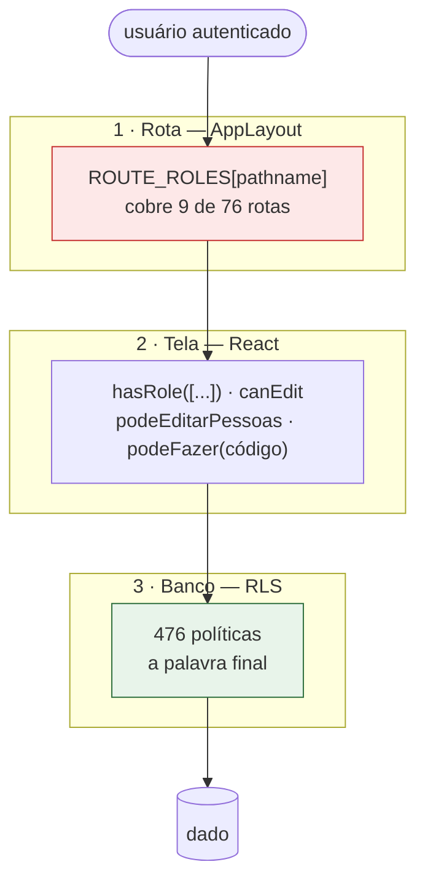
```mermaid
flowchart TD
    subgraph c1["1 · Rota — AppLayout"]
        R1["ROUTE_ROLES[pathname]<br/>cobre 9 de 76 rotas"]
    end
    subgraph c2["2 · Tela — React"]
        R2["hasRole([...]) · canEdit<br/>podeEditarPessoas · podeFazer(código)"]
    end
    subgraph c3["3 · Banco — RLS"]
        R3["476 políticas<br/>a palavra final"]
    end

    U(["usuário autenticado"]) --> R1 --> R2 --> R3 --> D[("dado")]

    style R3 fill:#e8f4ea,stroke:#2f6f3e
    style R1 fill:#fde8e8,stroke:#c53030
```

**Só a camada 3 é barreira de segurança.** As camadas 1 e 2 decidem o que *oferecer*;
elas evitam que a pessoa clique num botão que vai falhar, e nada mais.

**A camada 1 é rasa: `ROUTE_ROLES` protege 9 rotas de 76.** `/admin/*` e
`/financas/*` **não estão cobertas** — quem digitar a URL chega à tela. As telas se
defendem sozinhas com `hasRole(...)`, e a RLS é o backstop, mas isso depende de cada
tela lembrar.

### 4.2 Papéis e permissões

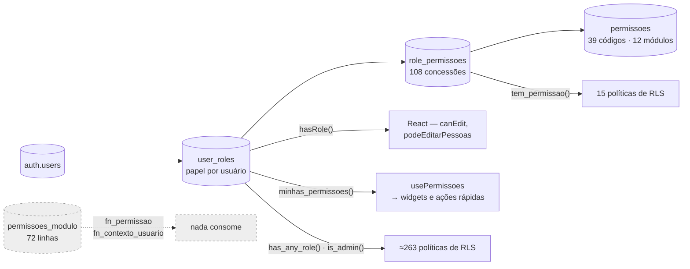
```mermaid
flowchart LR
    AU[("auth.users")] --> UR[("user_roles<br/>papel por usuário")]
    UR --> RP[("role_permissoes<br/>108 concessões")]
    RP --> PM[("permissoes<br/>39 códigos · 12 módulos")]

    UR -->|"hasRole()"| REACT["React — canEdit,<br/>podeEditarPessoas"]
    UR -->|"minhas_permissoes()"| UP["usePermissoes<br/>→ widgets e ações rápidas"]
    RP -->|"tem_permissao()"| P15["15 políticas de RLS"]
    UR -->|"has_any_role() · is_admin()"| P263["≈263 políticas de RLS"]

    PMOD[("permissoes_modulo<br/>72 linhas")] -.->|"fn_permissao<br/>fn_contexto_usuario"| MORTO["nada consome"]

    style PMOD fill:#eee,stroke:#999,stroke-dasharray: 4 4
    style MORTO fill:#eee,stroke:#999,stroke-dasharray: 4 4
```

**Existem dois modelos de permissão e só um está ligado.** `permissoes_modulo` e as
funções `fn_permissao`, `fn_contexto_usuario`, `fn_minha_permissao` e
`fn_todas_minhas_permissoes` **não são chamadas por nenhuma política nem por nenhuma
linha de código**. A grade `pode_ver/pode_criar/pode_editar/pode_excluir` daquela
tabela é a forma mais tentadora para uma tela de configuração — e é exatamente por
isso que é armadilha.

**Papel do usuário mora em `user_roles`.** `profiles.role` existe, **diverge** (estava
nulo em 3 dos 6 usuários) e não deve ser lido.

O enum `app_role` declara 10 valores — `admin, secretaria, diakonia, lideranca,
operador, voluntario, pastor, membro, visualizador, lider` — mas apenas 3 estavam em
uso. `diakonia` é legado, migrado para `pastor`.

### 4.3 A armadilha da escrita silenciosa

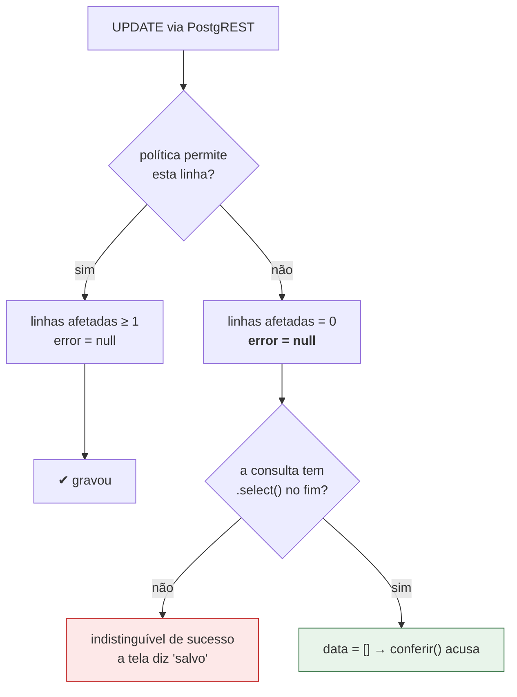
```mermaid
flowchart TD
    W["UPDATE via PostgREST"] --> RLS{"política permite<br/>esta linha?"}
    RLS -->|sim| OK["linhas afetadas ≥ 1<br/>error = null"]
    RLS -->|não| SIL["linhas afetadas = 0<br/><b>error = null</b>"]

    OK --> S1["✔ gravou"]
    SIL --> Q{"a consulta tem<br/>.select() no fim?"}
    Q -->|não| MENTIRA["indistinguível de sucesso<br/>a tela diz 'salvo'"]
    Q -->|sim| VERDADE["data = [] → conferir() acusa"]

    style MENTIRA fill:#fde8e8,stroke:#c53030
    style VERDADE fill:#e8f4ea,stroke:#2f6f3e
```

**No Postgres com RLS, um UPDATE barrado afeta zero linhas e devolve SUCESSO.** O
remédio é `lib/escritaConferida.ts`: `.select()` no fim e `conferir()` no retorno.
Hoje aplicado em 11 arquivos (19 usos); **cerca de 52 escritas ainda descartam o
resultado**.

### 4.4 Ao ler uma política, lembrar

**Políticas permissivas se somam com OR.** Uma tabela com `ALL: admin+secretaria` e
`DELETE: is_admin()` **permite secretaria apagar**, pela primeira. Ler uma política
isolada leva à conclusão errada.

Convenção sistêmica: **`DELETE` é quase sempre só de `is_admin()`**, enquanto
INSERT/UPDATE aceitam mais papéis. Isso faz o padrão "apaga tudo e reescreve" quebrar
em silêncio para não-admins.

---

## 5. Integração com Supabase

### 5.1 Dois clientes, um motivo

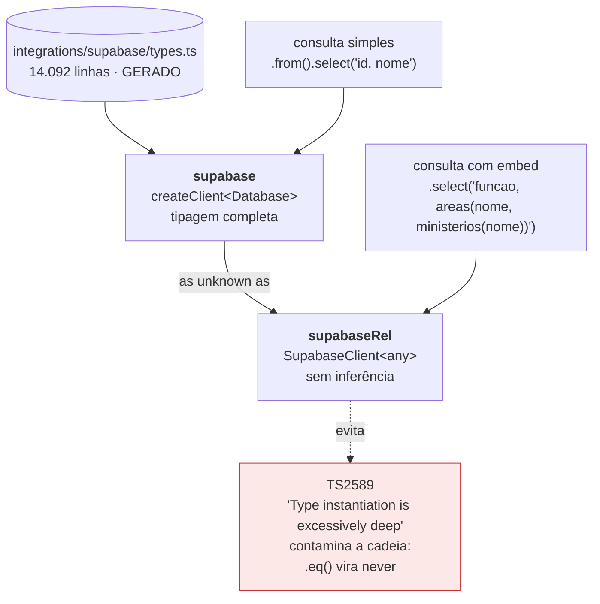
```mermaid
flowchart TD
    T[("integrations/supabase/types.ts<br/>14.092 linhas · GERADO")] --> C1
    C1["<b>supabase</b><br/>createClient&lt;Database&gt;<br/>tipagem completa"]
    C2["<b>supabaseRel</b><br/>SupabaseClient&lt;any&gt;<br/>sem inferência"]
    C1 -->|"as unknown as"| C2

    U1["consulta simples<br/>.from().select('id, nome')"] --> C1
    U2["consulta com embed<br/>.select('funcao, areas(nome, ministerios(nome))')"] --> C2

    C2 -.->|"evita"| ERR["TS2589<br/>'Type instantiation is excessively deep'<br/>contamina a cadeia:<br/>.eq() vira never"]

    style ERR fill:#fde8e8,stroke:#c53030
```

Com 284 objetos no schema, resolver um select aninhado faz o TypeScript percorrer o
grafo de relacionamentos e estourar o limite de profundidade. **A consulta é válida —
o limite é do compilador.**

**Regra:** `supabaseRel` **só** com embed. Sem embed, `supabase`, mantendo a
verificação.

### 5.2 As quatro portas

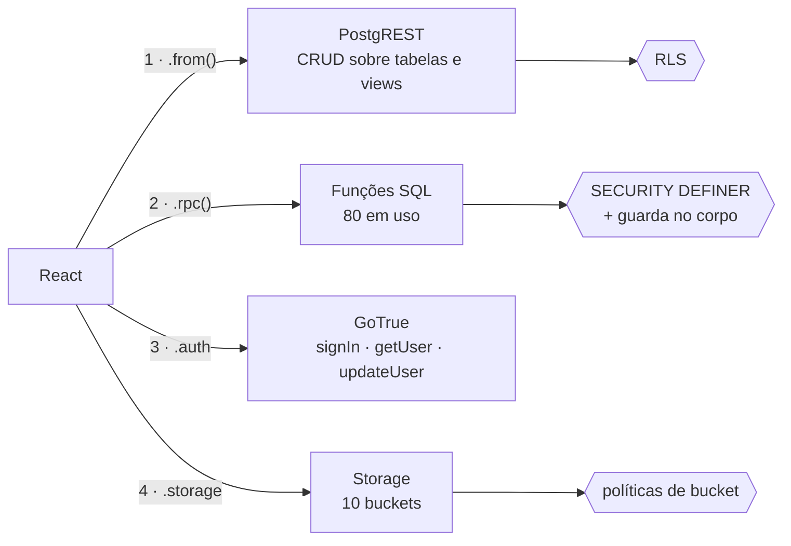
```mermaid
flowchart LR
    APP["React"]

    APP -->|"1 · .from()"| REST["PostgREST<br/>CRUD sobre tabelas e views"]
    APP -->|"2 · .rpc()"| RPC["Funções SQL<br/>80 em uso"]
    APP -->|"3 · .auth"| AUTH["GoTrue<br/>signIn · getUser · updateUser"]
    APP -->|"4 · .storage"| STO["Storage<br/>10 buckets"]

    REST --> RLS{{"RLS"}}
    RPC --> SD{{"SECURITY DEFINER<br/>+ guarda no corpo"}}
    STO --> POL{{"políticas de bucket"}}
```

**Funções `SECURITY DEFINER` ignoram a RLS por definição.** Por isso a guarda tem de
ser a **primeira linha do corpo**:

```sql
IF NOT public.is_admin() THEN
  RAISE EXCEPTION 'Apenas a administração pode ver o painel de acessos.';
END IF;
```

Sem isso, definer vira porta aberta.

### 5.3 Storage

| Bucket | Acesso | Usado pelo código |
|---|---|---|
| `documentos` | privado | ✔ |
| `ebd-aulas` | **público** | ✔ |
| `ebd-comprovantes` | privado | ✔ |
| `fin-comprovantes` | privado | ✔ |
| `fiscal-docs` | privado | ✔ |
| `locais-mapas` | **público** | ✔ |
| `membresia-docs` | privado | ✔ |
| `pgm-reunioes` | privado | ✔ |
| `arrecadacao-nf` | privado | ✘ dormente |
| `campanhas-materiais` | **público** | ✘ dormente |

**(incerto: não auditei o conteúdo dos buckets públicos — vale conferir se
`ebd-aulas` e `locais-mapas` guardam algo que não deveria ser aberto.)**

### 5.4 Migrations

**77 arquivos** em `supabase/migrations/`, de `20260429` a `20260820`, no formato
`AAAAMMDDHHMMSS_descricao_em_portugues.sql`. São a **fonte da verdade do schema** — e
cada uma traz um cabeçalho explicando o defeito que resolve, a medição que o
comprovou e a alternativa descartada.

**Não há ambiente de homologação.** Ensaiar com `BEGIN; … ROLLBACK;` antes de aplicar.

---

## 6. Fluxo React → RPC → Banco

### 6.1 Os dois caminhos

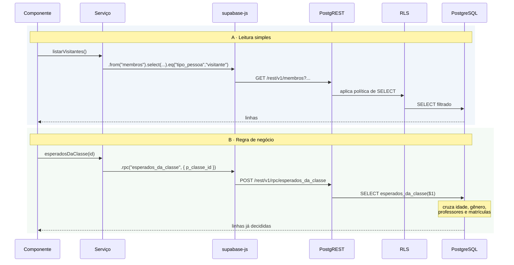
```mermaid
sequenceDiagram
    participant C as Componente
    participant S as Serviço
    participant SDK as supabase-js
    participant PR as PostgREST
    participant RLS as RLS
    participant PG as PostgreSQL

    rect rgba(200,220,240,.25)
    Note over C,PG: A · Leitura simples
    C->>S: listarVisitantes()
    S->>SDK: .from("membros").select(...).eq("tipo_pessoa","visitante")
    SDK->>PR: GET /rest/v1/membros?...
    PR->>RLS: aplica política de SELECT
    RLS->>PG: SELECT filtrado
    PG-->>C: linhas
    end

    rect rgba(210,235,215,.25)
    Note over C,PG: B · Regra de negócio
    C->>S: esperadosDaClasse(id)
    S->>SDK: .rpc("esperados_da_classe", { p_classe_id })
    SDK->>PR: POST /rest/v1/rpc/esperados_da_classe
    PR->>PG: SELECT esperados_da_classe($1)
    Note over PG: cruza idade, gênero,<br/>professores e matrículas
    PG-->>C: linhas já decididas
    end
```

**Regra de bolso:** se a decisão precisa de mais de uma tabela ou de uma regra que
valha fora do app, ela pertence a uma função SQL.

### 6.2 Escrita — o caminho completo, com conferência

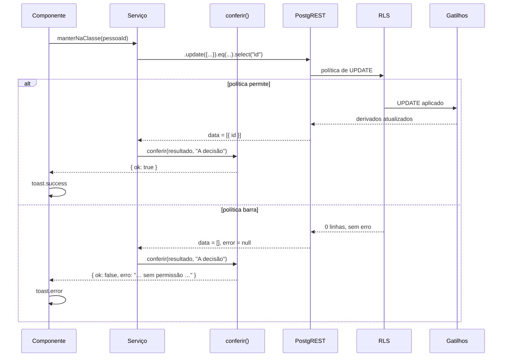
```mermaid
sequenceDiagram
    participant C as Componente
    participant S as Serviço
    participant CF as conferir()
    participant PR as PostgREST
    participant RLS as RLS
    participant TG as Gatilhos

    C->>S: manterNaClasse(pessoaId)
    S->>PR: .update({...}).eq(...).select("id")
    PR->>RLS: política de UPDATE
    alt política permite
        RLS->>TG: UPDATE aplicado
        TG-->>PR: derivados atualizados
        PR-->>S: data = [{ id }]
        S->>CF: conferir(resultado, "A decisão")
        CF-->>C: { ok: true }
        C->>C: toast.success
    else política barra
        RLS-->>PR: 0 linhas, sem erro
        PR-->>S: data = [], error = null
        S->>CF: conferir(resultado, "A decisão")
        CF-->>C: { ok: false, erro: "… sem permissão …" }
        C->>C: toast.error
    end
```

O `.select("id")` é o que torna os dois ramos distinguíveis. **Sem ele, os dois
retornam a mesma coisa.**

### 6.3 Gatilhos mantêm o derivado

**123 gatilhos.** Exemplo em produção: `trg_atualizar_carga` mantém carga,
sobrecarga e última escala de um voluntário, **e cria a linha de `perfil_servico`**
na primeira escala.

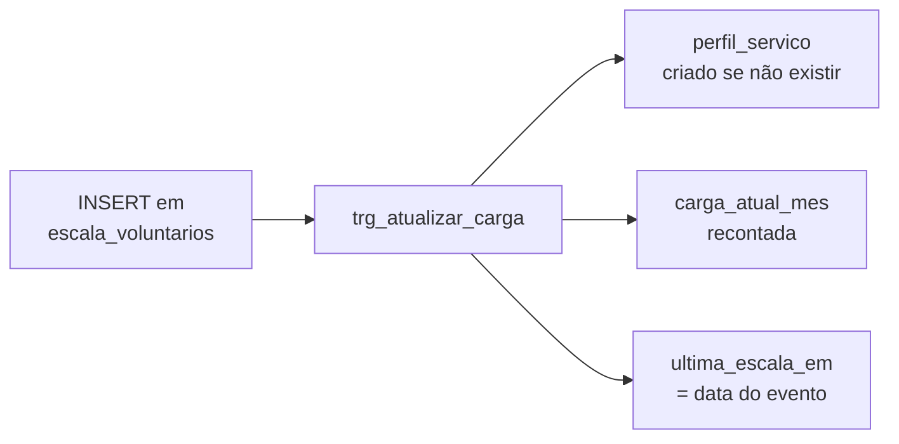
```mermaid
flowchart LR
    E["INSERT em<br/>escala_voluntarios"] --> T["trg_atualizar_carga"]
    T --> P1["perfil_servico<br/>criado se não existir"]
    T --> P2["carga_atual_mes<br/>recontada"]
    T --> P3["ultima_escala_em<br/>= data do evento"]
```

**Não preencher esses campos à mão** — o gatilho recalcula e sobrescreve.

---

## 7. Principais entidades

### 7.1 `membros` é o eixo

**69 chaves estrangeiras apontam para `membros`.** Nenhuma outra tabela chega perto.

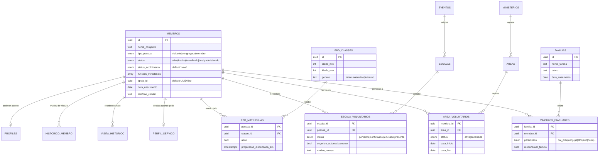
```mermaid
erDiagram
    MEMBROS ||--o{ VINCULOS_FAMILIARES : "pertence a"
    FAMILIAS ||--o{ VINCULOS_FAMILIARES : "reúne"
    MEMBROS ||--o{ AREA_VOLUNTARIOS : "serve em"
    AREAS ||--o{ AREA_VOLUNTARIOS : "recebe"
    MINISTERIOS ||--o{ AREAS : "agrupa"
    MEMBROS ||--o| PERFIL_SERVICO : "declara quando pode"
    MEMBROS ||--o{ ESCALA_VOLUNTARIOS : "é escalado"
    ESCALAS ||--o{ ESCALA_VOLUNTARIOS : "compõe"
    EVENTOS ||--o{ ESCALAS : "origina"
    MEMBROS ||--o{ EBD_MATRICULAS : "matriculado"
    EBD_CLASSES ||--o{ EBD_MATRICULAS : "recebe"
    MEMBROS ||--o{ VISITA_HISTORICO : "recebeu contato"
    MEMBROS ||--o{ HISTORICO_MEMBRO : "mudou de vínculo"
    MEMBROS ||--o| PROFILES : "pode ter acesso"

    MEMBROS {
        uuid id PK
        text nome_completo
        enum tipo_pessoa "visitante|congregado|membro"
        enum status "ativo|inativo|transferido|desligado|falecido"
        enum status_acolhimento "default 'novo'"
        array funcoes_ministeriais
        uuid igreja_id "default UUID fixo"
        date data_nascimento
        text telefone_celular
    }
    FAMILIAS {
        uuid id PK
        text nome_familia
        text bairro
        date data_casamento
    }
    VINCULOS_FAMILIARES {
        uuid familia_id FK
        uuid membro_id FK
        enum parentesco "pai_mae|conjuge|filho|avo|neto|..."
        bool responsavel_familia
    }
    AREA_VOLUNTARIOS {
        uuid membro_id FK
        uuid area_id FK
        enum status "ativa|encerrada"
        date data_inicio
        date data_fim
    }
    ESCALA_VOLUNTARIOS {
        uuid escala_id FK
        uuid pessoa_id FK
        enum status "pendente|confirmado|recusado|presente"
        bool sugerido_automaticamente
        text motivo_recusa
    }
    EBD_CLASSES {
        uuid id PK
        int idade_min
        int idade_max
        text genero "misto|masculino|feminino"
    }
    EBD_MATRICULAS {
        uuid pessoa_id FK
        uuid classe_id FK
        bool ativo
        timestamptz progressao_dispensada_em
    }
```

### 7.2 Três armadilhas do modelo

**1 · Uma tabela para três vínculos.** Visitante, congregado e membro são **linhas de
`membros`**, discriminadas por `tipo_pessoa`. Não existe tabela de visitantes.

**2 · `tipo_pessoa` e `status` são ortogonais.**

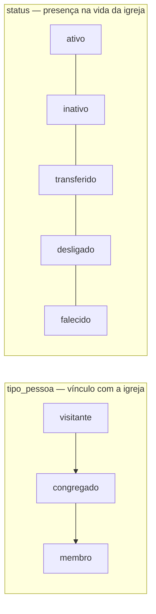
```mermaid
flowchart LR
    subgraph tp["tipo_pessoa — vínculo com a igreja"]
        V["visitante"] --> C["congregado"] --> M["membro"]
    end
    subgraph st["status — presença na vida da igreja"]
        A["ativo"] --- I["inativo"] --- T["transferido"] --- D["desligado"] --- F["falecido"]
    end
```

Um membro pode estar inativo. **Filtrar por um pensando no outro é o erro mais fácil
deste banco.**

**3 · Enums com gênero diferente.** `atuacao_status` tem `ativa`/`encerrada`;
`membro_status` tem `ativo`. Um valor inválido em `.in()` **não filtra a mais — o
Postgres rejeita a consulta INTEIRA** com "invalid input value for enum".

### 7.3 Identidade e acesso

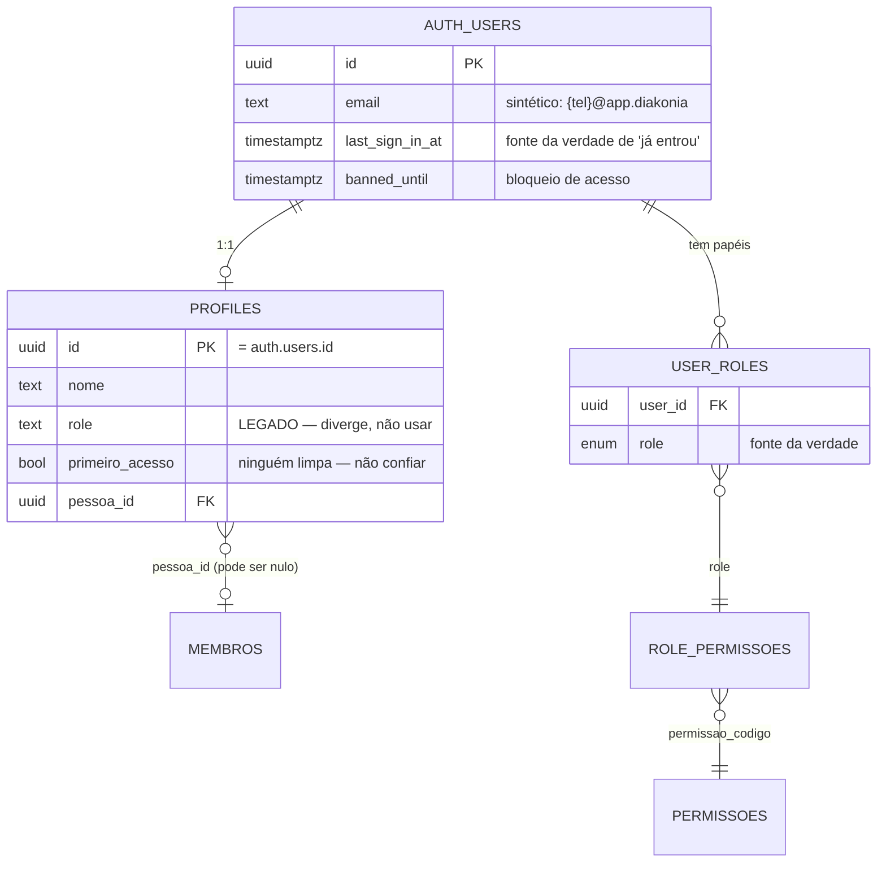
```mermaid
erDiagram
    AUTH_USERS ||--o| PROFILES : "1:1"
    AUTH_USERS ||--o{ USER_ROLES : "tem papéis"
    PROFILES }o--o| MEMBROS : "pessoa_id (pode ser nulo)"
    USER_ROLES }o--|| ROLE_PERMISSOES : "role"
    ROLE_PERMISSOES }o--|| PERMISSOES : "permissao_codigo"

    AUTH_USERS {
        uuid id PK
        text email "sintético: {tel}@app.diakonia"
        timestamptz last_sign_in_at "fonte da verdade de 'já entrou'"
        timestamptz banned_until "bloqueio de acesso"
    }
    PROFILES {
        uuid id PK "= auth.users.id"
        text nome
        text role "LEGADO — diverge, não usar"
        bool primeiro_acesso "ninguém limpa — não confiar"
        uuid pessoa_id FK
    }
    USER_ROLES {
        uuid user_id FK
        enum role "fonte da verdade"
    }
```

**Duas colunas que mentem** e estão documentadas como tal: `profiles.role` (nulo em 3
de 6 usuários) e `profiles.primeiro_acesso` (`true` para todos, inclusive quem já
entrou). Use `user_roles.role` e `auth.users.last_sign_in_at`.

### 7.4 Costura multi-tenant — parcial

**Apenas 15 das 143 tabelas têm `igreja_id`**; outras 4 têm `congregacao_id`. O valor
vem de um **default de coluna** com o UUID fixo de `src/lib/igreja.ts`.

Multi-tenant, portanto, **não é trocar uma constante**: 128 tabelas não têm coluna de
inquilino. É projeto, não ajuste.

---

## 8. Dependências entre módulos

### 8.1 Módulos funcionais

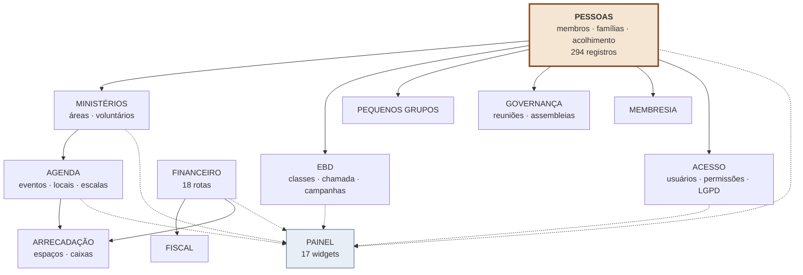
```mermaid
flowchart TD
    PESSOAS["<b>PESSOAS</b><br/>membros · famílias · acolhimento<br/>294 registros"]

    MIN["MINISTÉRIOS<br/>áreas · voluntários"]
    AGENDA["AGENDA<br/>eventos · locais · escalas"]
    EBD["EBD<br/>classes · chamada · campanhas"]
    PGM["PEQUENOS GRUPOS"]
    GOV["GOVERNANÇA<br/>reuniões · assembleias"]
    MEMB["MEMBRESIA"]
    FIN["FINANCEIRO<br/>18 rotas"]
    FISC["FISCAL"]
    ARR["ARRECADAÇÃO<br/>espaços · caixas"]
    ACESSO["ACESSO<br/>usuários · permissões · LGPD"]
    PAINEL["PAINEL<br/>17 widgets"]

    PESSOAS --> MIN
    PESSOAS --> EBD
    PESSOAS --> PGM
    PESSOAS --> GOV
    PESSOAS --> MEMB
    PESSOAS --> ACESSO
    MIN --> AGENDA
    AGENDA --> ARR
    FIN --> FISC
    FIN --> ARR

    PESSOAS -.-> PAINEL
    AGENDA -.-> PAINEL
    EBD -.-> PAINEL
    MIN -.-> PAINEL
    FIN -.-> PAINEL
    ACESSO -.-> PAINEL

    style PESSOAS fill:#f5e6d3,stroke:#8a4b24,stroke-width:3px
    style PAINEL fill:#e8eef5,stroke:#3a5a7a
```

**`PESSOAS` é o módulo do qual todos dependem** e que não depende de nenhum. Mexer
em `membros` ou em `tipo_pessoa` propaga para o sistema inteiro.

**`PAINEL` depende de todos e ninguém depende dele** (linha tracejada) — cada widget
lê o seu domínio. É o ponto mais barato de mudar e o mais caro de quebrar, porque é a
primeira tela.

### 8.2 Acoplamento medido

| De → Para | Imports | Leitura |
|---|---|---|
| `pages → ui` | 353 | Esperado |
| `components → ui` | 333 | Esperado |
| `pages → components` | 134 | Esperado |
| `pages → services` | 56 | **Menor que `pages → integrations` (39) + escrita direta** |
| `components → services` | 53 | — |
| `components → lib` | 52 | Regras puras bem reaproveitadas |
| `services → integrations` | 29 | Todo serviço fala com o Supabase |
| `components → pages` | 6 | ⚠️ **Inversão de camada** |

Os serviços são **praticamente independentes entre si** — só 3 importam outro
serviço. Baixo acoplamento horizontal, e isso é bom.

### 8.3 Pontos de contato compartilhados

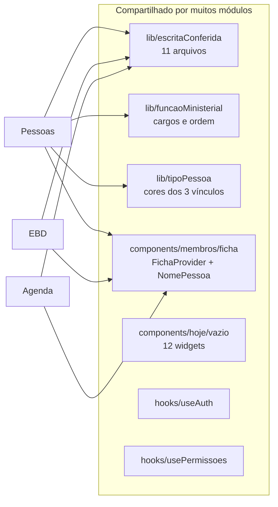
```mermaid
flowchart LR
    subgraph comp["Compartilhado por muitos módulos"]
        EC["lib/escritaConferida<br/>11 arquivos"]
        FM["lib/funcaoMinisterial<br/>cargos e ordem"]
        TP["lib/tipoPessoa<br/>cores dos 3 vínculos"]
        FI["components/membros/ficha<br/>FichaProvider + NomePessoa"]
        VZ["components/hoje/vazio<br/>12 widgets"]
        UA["hooks/useAuth"]
        UP["hooks/usePermissoes"]
    end
    M1["Pessoas"] --> EC
    M2["EBD"] --> EC
    M3["Agenda"] --> EC
    M1 --> FI
    M2 --> FI
    M3 --> FI
    M1 --> TP
    M1 --> FM
```

**Estes arquivos são infraestrutura de domínio.** Mudança neles atinge vários
módulos ao mesmo tempo — e é exatamente onde os comentários longos do repositório
mais valem a leitura.

### 8.4 O que está desligado

```mermaid
flowchart LR
    subgraph vivo["Consultado pelo código — 116 objetos"]
        A1["tabelas e views em uso"]
    end
    subgraph dormente["Dormente — 57 objetos"]
        B1["<b>pdv_*</b> — 8 tabelas<br/>módulo de PDV<br/>ZERO arquivos em src/"]
        B2["11 views v_*"]
        B3["4 views vw_*"]
        B4["permissoes_modulo<br/>+ 4 funções fn_*"]
        B5["2 buckets de storage"]
        B6["34 outras tabelas"]
    end
    style dormente fill:#f5f5f5,stroke:#999,stroke-dasharray: 5 5
```

**57 dos 173 objetos do banco nunca são consultados.** Antes de criar qualquer
coisa, **conferir se já existe** — inclusive um módulo inteiro de ponto de venda,
modelado e nunca construído.

---

## Referências

- [CLAUDE.md](./CLAUDE.md) — onboarding, regras de negócio, riscos e mitigação
- `supabase/migrations/` — fonte da verdade do schema, com a razão de cada mudança
- `src/lib/escritaConferida.ts` — o comentário mais importante do repositório
- `src/integrations/supabase/client.ts` — por que existem dois clientes
